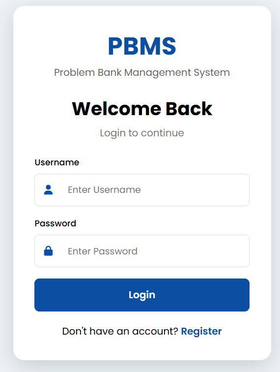
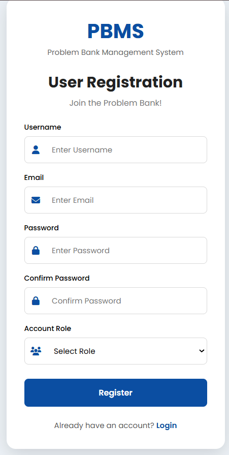
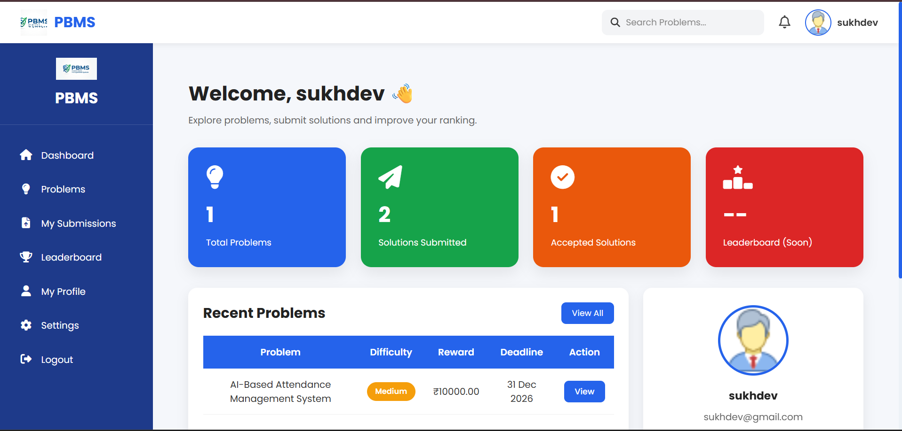
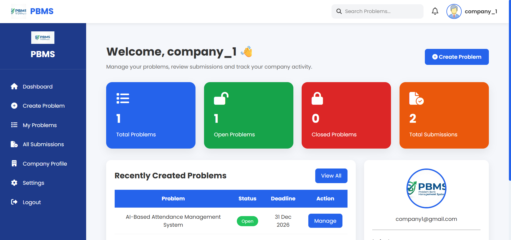
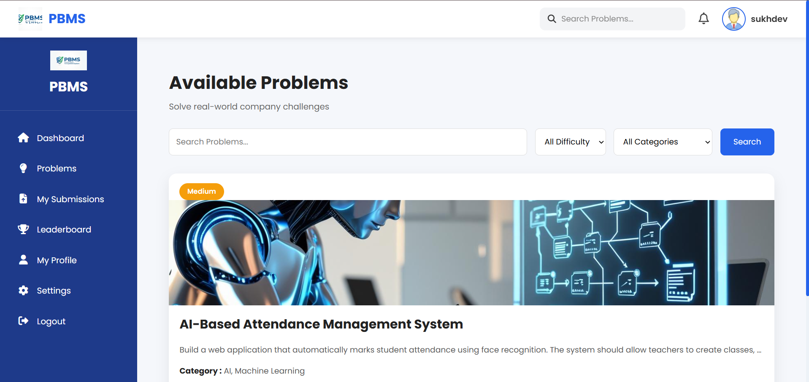
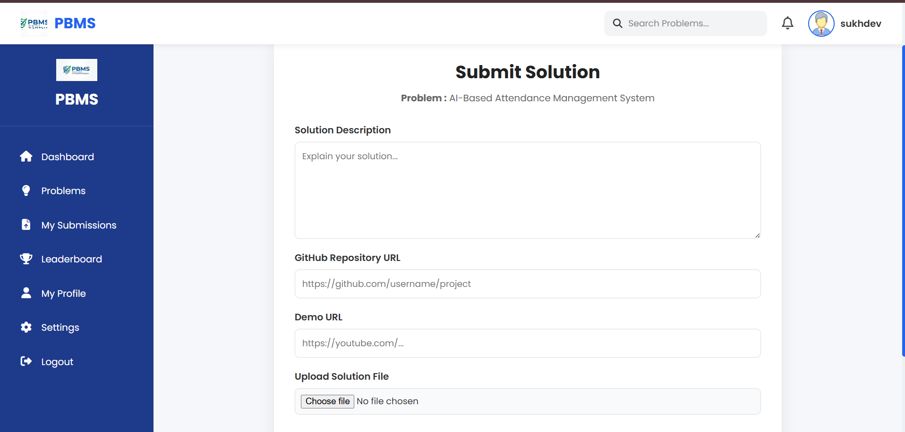
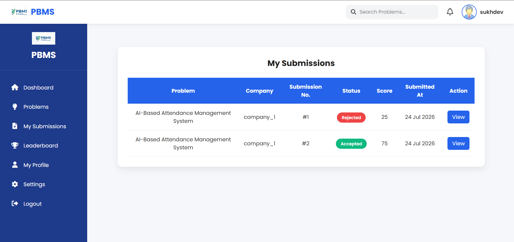
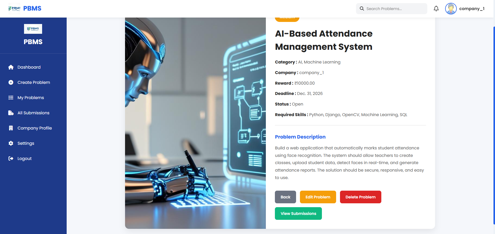
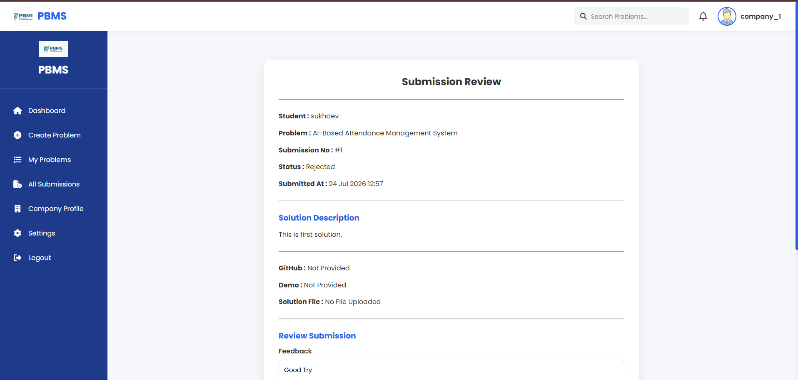

# Problem Bank

> A full-stack Django-based **Problem Bank Management System (PBMS)** that connects **companies** with **students** by enabling organizations to post real-world challenges and allowing students to submit innovative solutions.

<p align="center">


</p>

---

## 📖 Overview

**Problem Bank Management System (PBMS)** is a Django-based web application that bridges the gap between **students** and **companies**.

Companies can publish real-world challenges, while students can solve them by submitting innovative ideas, documents, or source code. Companies can evaluate submissions, provide feedback, assign scores, and select the best solution.

The platform provides separate dashboards for **Students**, **Companies**, and **Administrators**, making the entire workflow simple and efficient.

---

# ✨ Features

## 👨‍🎓 Student Module

- Student Registration
- Student Login & Logout
- Student Dashboard
- View Available Problems
- Problem Details
- Search Problems
- Submit Solution
- Multiple Solution Submission
- View Submission Details
- Track Submission Status
- View Company Feedback

---

## 🏢 Company Module

- Company Registration
- Company Login & Logout
- Company Dashboard
- Create Problem
- Update Problem
- Delete Problem
- View Posted Problems
- Review Student Submissions
- Accept / Reject Solutions
- Assign Scores
- Provide Feedback

---

## 🛡️ Admin Module

- Manage Users
- Manage Companies
- Manage Problems
- Manage Solutions
- Verify Companies
- Moderate Platform Content

---

# 🛠️ Tech Stack

| Category | Technology |
|----------|------------|
| Backend | Python, Django |
| Frontend | HTML, CSS, Bootstrap, JavaScript |
| Database | SQLite |
| Authentication | Django Authentication |
| Version Control | Git & GitHub |

---

# 🗄️ Database Models

The project is designed using Django ORM.

### Implemented Models

- ✅ CustomUser
- ✅ StudentProfile
- ✅ CompanyProfile
- ✅ Problem
- ✅ Solution

---

# 📊 Project Progress

| Module | Progress |
|---------|----------|
| Authentication | ✅ 100% |
| Student Module | 🟢 90% |
| Company Module | 🟢 90% |
| Problem Module | ✅ 100% |
| Submission Module | ✅ 100% |
| Database Design | ✅ 100% |
| UI / UX | 🟢 85% |

## Overall Project Completion

**🚀 Approximately 90% Complete**

---

# 📂 Project Structure

```text
Problem-Bank/
│
├── accounts/
├── problems/
├── submissions/
├── problembank/
├── templates/
├── static/
├── media/
│
├── manage.py
├── requirements.txt
├── screenshots/
├── README.md
└── .gitignore
```

---

# 📸 Application Screenshots

## 🔐 Login Page



---

## 📝 Register Page



---

## 👨‍🎓 Student Dashboard



---

## 🏢 Company Dashboard



---

## 📄 Problem Details



---

## 📤 Submit Solution



---

## 📋 My Submissions



---

## 🛠️ Company Problem Management



---

## ✅ Review Submission



---

# ⚙️ Installation

## Clone Repository

```bash
git clone https://github.com/sukhdevdogiyal/Problem-Bank.git
```

## Navigate to Project

```bash
cd Problem-Bank
```

## Create Virtual Environment

```bash
python -m venv myenv
```

## Activate Virtual Environment

### Windows

```bash
myenv\Scripts\activate
```

### Linux / macOS

```bash
source myenv/bin/activate
```

## Install Dependencies

```bash
pip install -r requirements.txt
```

## Apply Database Migrations

```bash
python manage.py migrate
```

## Start Development Server

```bash
python manage.py runserver
```

Open your browser and visit:

```
http://127.0.0.1:8000/
```

---

# 🚀 Development Roadmap

## ✅ Completed

- Django Project Setup
- GitHub Repository Setup
- Custom User Model
- Student Profile Model
- Company Profile Model
- Role-Based Authentication
- Student Dashboard
- Company Dashboard
- Problem CRUD
- Solution Submission
- Submission Review System
- Feedback & Score System
- Database Design

---

## 🚧 In Progress

- Student Profile Page
- Company Profile Page
- Edit Profile
- Leaderboard
- Advanced Search
- Settings

---

## 📌 Planned Features

- Email Notifications
- Password Reset
- Charts & Analytics
- Landing Page Improvements
- Contact Page
- FAQ Page
- REST API
- Deployment

---

# 🔮 Future Enhancements

- AI-Based Solution Recommendation
- Real-Time Notifications
- Payment Gateway Integration
- Resume Builder
- Certificates
- Discussion Forum
- Leaderboard
- Analytics Dashboard

---

# 🤝 Contributing

Contributions are welcome!

1. Fork this repository

2. Create a feature branch

```bash
git checkout -b feature-name
```

3. Commit your changes

```bash
git commit -m "Add new feature"
```

4. Push to GitHub

```bash
git push origin feature-name
```

5. Open a Pull Request

---

# 📄 License

This project is licensed under the **MIT License**.

---

# 👨‍💻 Author

**Sukhdev Dogiyal**

🎓 B.Tech Computer Science Engineering

💻 Backend Developer | Django Enthusiast | Problem Solver

📧 Email: sukhdev951157@gmail.com

🔗 GitHub: https://github.com/sukhdevdogiyal

---

## ⭐ Support

If you found this project useful, please consider giving it a **⭐ Star** on GitHub.

It motivates future development and improvements.